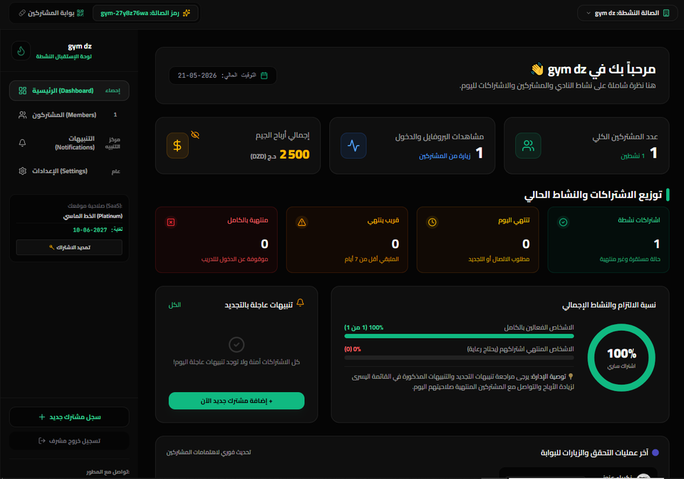
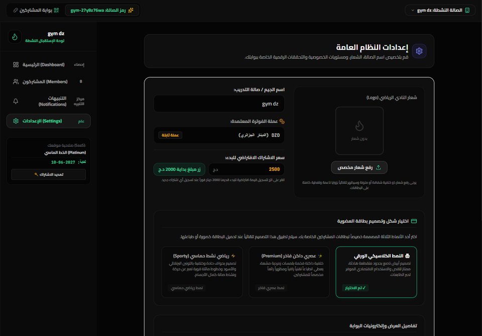
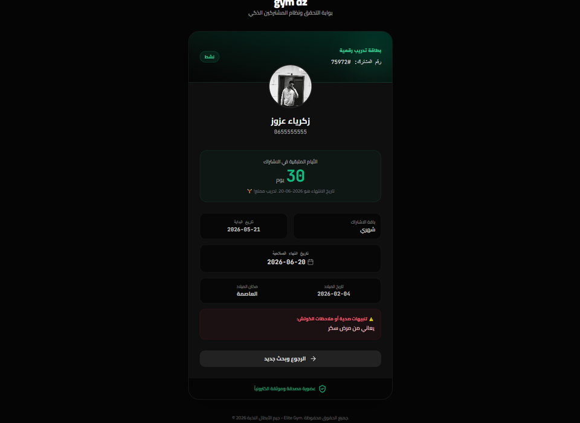
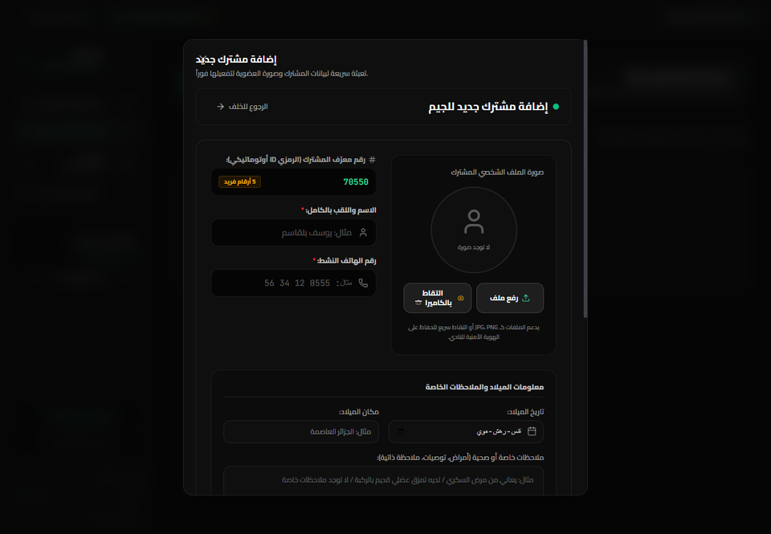

# Elite Gym SaaS - Multi-Tenant Management System
> نظام احترافي وشامل لإدارة الصالات الرياضية والاشتراكات في بيئة سحابية متكاملة (SaaS) متعددة المستأجرين مع بوابة ذكية للمشتركين.

---

## 📌 نبذة عن المشروع / Project Overview

هذا النظام هو عبارة عن منصة **SaaS سحابية متكاملة ومتعددة المستأجرين (Multi-tenant Gym Management System)** مصممة خصيصاً لإدارة الصالات الرياضية واشتراكات الأعضاء بكفاءة عالية. يحتوي النظام على لوحة تحكم إدارية متطورة لإدارة وتجديد اشتراكات الأعضاء، وبوابة منفصلة خاصة بالمشتركين للتحقق اللحظي من حالة اشتراكاتهم عبر الرقم السري أو من خلال مسح الرمز السريع (QR Code).

This is a professional **Multi-tenant Gym SaaS & Subscription Management System** built with React, Vite, Tailwind CSS, and powered by Firebase Firestore. It provides gym administrators with a powerful central hub to manage memberships and track finances, paired with an elegant, responsive mobile-first Client Portal for members to query their subscription duration and scan unified QR badges.

---

## 🎯 أهداف المشروع / Purpose of the Project

تم بناء هذا المشروع وتطويره لتحقيق أفضل الممارسات في:
- **إدارة الأنظمة متعددة المستأجرين (SaaS architecture)** وفصل البيانات بشكل آمن بين الصالات.
- **تأمين بوابات العملاء (Client Security Framework)** ومنع الوصول غير المصرح به للأعضاء المنتهية صلاحيتهم أو الصالات الموقوفة.
- **التصميم المستجيب والمتطور (Advanced Responsive UI/UX)** وتوفير شاشات حظر ذكية وحالات تفاعلية راقية.
- **تحسين سرعة التصفح والتحميل** بالاعتماد على أحدث الاستجابات السريعة لـ Firestore.

---

## 🛠️ التقنيات المستخدمة / Technologies Used

- **React 19 & TypeScript**: لبناء واجهات مستخدم قوية ومنظمة وذات نوعية بيانات آمنة وسريعة.
- **Vite**: الخيار الأسرع لبناء وتجميع تطبيقات الويب الحديثة.
- **Tailwind CSS**: لتصميم وتنسيق الواجهات بهيكل عصري أنيق ومظهر جذاب يوفر الوضع الداكن الرائع (Premium Dark Theme).
- **Firebase Firestore & Authentication**: قاعدة بيانات سحابية لحظية وسريعة لتخزين ومزامنة البيانات بأعلى معايير الحماية والاستقرار.
- **Motion (motion/react)**: لإضافة حركات انتقالية وتأثيرات بصرية انسيابية تمنح التطبيق طابع التطبيقات الأصلية (Native Feel).
- **Lucide Icons**: أيقونات متجهة فائقة الدقة والوضوح لجميع أزرار وعناصر لوحة التحكم.

---

## 💎 مزايا النظام الاستثنائية / Key Features

### 1. إدارة حالة الصالات والتعطيل التلقائي (Gym State & Lockout Controls)
* **الحظر المؤقت (Suspended Screen) ⚠️**: بمجرد تحويل حالة الجيم السحابية إلى `suspended` أو `inactive` أو `closed` تظهر شاشة حظر كاملة باللون البرتقالي الأنيق لإشعار الإدارة بالتواصل مع المطور لشحن وتفعيل المنصة فوراً.
* **انتهاء الاشتراك (Expired Lockout) ❌**: يقوم النظام بفحص ومقارنة تاريخ الاشتراك المتبقي `endDate` بالوقت اللحظي الحقيقي وتاريخ اليوم بشكل ديناميكي دقيق. عند تخطي التاريخ، يتم حجب اللوحة والطلب من المالك تجديد الاشتراك بالكود التفعيلي الفوري.
* **شاشة الحذف الكامل (Deleted State) ❌**: إذا لم يتم العثور على وثيقة الجيم الرياضي المسجلة في السيرفر، يتم عرض شاشة حظر باللون الأحمر تدل على حذف المنشأة بالكامل وتوجيه المالك للبحث عن دعم فني.

### 2. بوابة المشتركين المأمونة (Dynamic Secure Member Portal)
* مصممة برابط نظيف وبسيط يخدم المشتركين `?portal=true` لسهولة الفحص اللحظي لهواتفهم.
* **حماية قصوى لبوابات المرور**: قبل السماح لأي عضو عادي بالبحث أو عرض معلومات حساسة، تقوم البوابة بالتحقق من سلامة وصلاحية رخصة نادي الجيم أولاً وحجبه فوراً بشاشات القفل المعنية إن كانت غير مفعلة، مما يوفر نظاماً صارماً لتحفيز وجباية المستحقات المالية.

### 3. الحفاظ على سرية معلومات المطور (Developer Contact Privacy Guard)
* تماشياً مع الطابع التجاري الاحترافي، تم فصل وإزالة تفاصيل المطور وسيرته التوضيحية (تيليجرام وانستجرام) بالكامل من شاشات المشتركين وبوابات البحث العامة لتبدو المنصة كمنتج مستقل تماماً ومطلي باسم الصالة الرياضية المشتركة فقط.
* تنحصر بيانات دعم وتواصل المطور المباشر في لوحات حظر الاشتراك وصناديق المساعدة الإدارية الداخلية فقط لمدراء الصالات عند انقطاع الخدمة أو الرغبة بالتحديث الفوري.

---

## 📸 لقطات من داخل النظام / Screenshots

* **لوحة التحكم الشاملة (Main SaaS Dashboard)**
  

* **شاشة اعدادات الجيم (SaaS Expiry Guard)**
  

* **بوابة المشتركين الذكية (Secure Client Portal)**
  

* **اضافة الاعضاء (Secure Client Portal)**
  

---

## 📈 الدروس والمهارات المكتسبة / What I Learned

- هندسة وبناء البرمجيات المستضافة وتداول الرخص والمفاتيح الرقمية سحابياً لجني الاشتراكات بصيغة (SaaS Model).
- تطوير شاشات حماية متعددة المراحل تؤمن سلامة المعطيات وصلاحيات المجموعات.
- صياغة وتوفير معايير الخصوصية الكاملة وفصل الطبقة الإدارية عن الطبقة البيئية والعملاء النهائيين.
- تحجيم وضبط التنسيقات والتحويلات الزمنية باستخدام قراءات ساعة التوقيت العالمي والأنظمة اللحظية لتفادي التلاعب بالصلاحيات.

---

## 💬 تواصل مع المطور / Contact Information

لطلب تفعيل النظام، الاستفسار، أو شراء رخص جديدة للمنصة، يرجى التواصل مباشرة عبر القنوات الرسمية للمطور:

* **Telegram**: [👉 @zg22x](https://t.me/zg22x)
